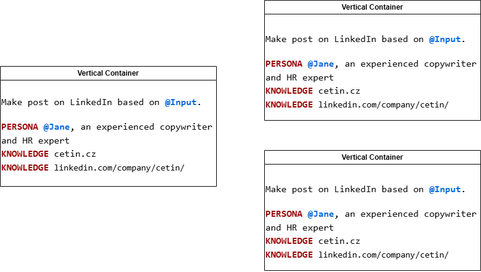

# 📘 Book Language Blueprint

Book is a simple format do define AI apps and agents. It is the source code the soul of AI apps and agents.. It's purpose is to avoid ambiguous UIs with multiple fields and low-level ways like programming in langchain.

Book is defined in file with .book extension

## Examples

```book
Write an article about {topic}

PERSONA Jane, marketing specialist with prior experience in tech and AI writing
KNOWLEDGE https://wikipedia.org/
KNOWLEDGE ./journalist-ethics.pdf
EXPECT 1 Sentence - 5 Pages
RESULT {article}
```

---

```book
Make post on LinkedIn based on @Input.
PERSONA @Jane, an experienced copywriter and HR expert
KNOWLEDGE cetin.cz
KNOWLEDGE linkedin.com/company/cetin/
```

---

```book
Odpověz na Email

{Email content}

PERSONA @Pavol - pavolhejny.com
KNOWLEDGE ./instructions.pdf
STYLE Professional tone of voice
```

---

```book
Analyzuj {Případ}.
{Detaily}
PERSONA @Jiří, právník, který nikdy neodešle informace o klientech mimo EU
KNOWLEDGE {89/2012 Sb. Občanský zákoník}

```

iframe:

<iframe frameborder="0" style="width:100%;height:455px;" src="https://viewer.diagrams.net/?tags=%7B%7D&lightbox=1&highlight=0000ff&edit=_blank&layers=1&nav=1&title=#R%3Cmxfile%20scale%3D%221%22%20border%3D%220%22%20disableSvgWarning%3D%22true%22%20linkTarget%3D%22_blank%22%3E%3Cdiagram%20name%3D%22Page-1%22%20id%3D%22zo4WBBcyATChdUDADUly%22%3E7ZxtU%2BM2EMc%2FjWfaF2b8kMTwEkKOu%2Fa468BM77ViK4mKLLmy8nSfvitbihPiNEAaIHTfYHm1luzVT7vG%2F5l4cT9f3ChSTG5lRrkXBdnCi6%2B9KAo7YQ8OxrK0liBKastYsczaGsM9%2B0mdo7VOWUbLDUctJdes2DSmUgia6g0bUUrON91Gkm%2FOWpCxnTFoDPcp4XTL7QfL9KS2nnfXvD9TNp64mcPA9uTEOVtDOSGZnK%2BZ4oEX95WUum7liz7lJnouLvV1n3b0rm5MUaGfcoFdiRnhU%2Ftsf1KlGTwqWPtSaMIEVfZe9dIFoJyznBMBZ1fzCdP0viCp6ZrDgoNtonMOZyE07fgwKF3svMdw9eTADJU51WoJLvYCP7qw0bK8JPZ03sQ%2B7lnbZC3ukQs7ses9Xo3dhAQaNirtEbrYipAX9TjMcFUWRDSOvb%2BnZtGuMpmWPhOaKkG4b0j1R2EcdbNO6iej0cgfhufQGiaJnw7PaXIRJT2adpsBoDW2x2qaYiP0zovDuvjuYS%2FDs%2FgcjDlRYyZ8LQtjiwrd2IZSa5k35vX5goypzcG12n0%2F9rG3b2kEuPhltVkvwWE1UVB1jEjO%2BLLugmtIbkCxV95JuD0JHbdSyMedXtQ3Owd6ypqyq2pnc6nqwdR4%2BEtQO7nDr7XTkKQPYyWnIvPX%2FLUionT0rW5vRhQjcBTTnCqW1q5Cqhx2wrYXJaX2SQntPY6EVyBok63%2B1bGQJdNM7huP5vIvtu0zs5sW5mNjO8aQlNRQUntU29SvImiCwUlR2nUqFC2pmtFHUNSLfkseqPGRpYaDNAv%2FlYkHmn0RdorM2R0fsKFqRN4%2FNhe1Uxh060YUJi9AZ%2B52IRgSYBCh2gOV1wm%2BiGKqT5AYTDRHYuJsDwxgLl5WGTtRGHW3imOntTgGH7A2ht34YGgxxT0T5z8Gd%2Fffv11iWURmnlMWfzP%2FU50eMFgVj4VEFdBqwemigMhQkVZv3KkslnMFY6qq35g%2B3zmvfS9WB9TSoLddSwMspZgWj7cHfv%2F2%2FcfXwfXN4DSLKebGI3GRUs3EWfoTkx0muw8D9TGSXYjJ7uS54NVHV5PvIN9En%2BAvrP7StEwWNGLG87NgxmbI1P%2BYKbfoQ9VCyw6IWpjZcn6kFWq6MPY1TdA%2ByDWnI9PjHvDSmnOWZXyXtFgtOTWSW7CabI%2B62GtXF62Y2HmimBg64yFiohOw37XeGjod20bIf2qI%2FhO9NQxRcH3%2FL4eYlFFwxS%2FLpwIVCq7IBAqur4Usfjh5A5xRcEVmUHDFqoiCK5ZSTIsH7QEUXJGLNi5QcMVk9%2BGgRsEVuWjjAgVXZAoFV%2B9FgmsYtOuLb6K4RieouK504tdRXGNUXN%2F%2F2yFmZVRc8dPyqUCFiisygYrrayGLX07eAGdUXJEZVFyxKqLiiqUU0%2BJBewAVV%2BSijQtUXDHZfTioUXFFLtq4QMUVmULF1XuZ4hq9meIKp83PFVd9N82vPseDfwA%3D%3C%2Fdiagram%3E%3C%2Fmxfile%3E"></iframe>

books.svg


books.png



## Basic Commitments:

Book is composed of commitments, which are the building blocks of the book. Each commitment defines a specific task or action to be performed by the AI agent. The commitments are defined in a structured format, allowing for easy parsing and execution.

<!--
TODO:
## **1. What:** Workflows, Tasks and Parameters
## **2. Who:** Personas
## **3. How:** Knowledge, Instruments and Actions
-->

### `PERSONA`

defines basic contour of

> PERSONA @Joe Average man with

also the PERSONA is

Describes

### `RULE` or `RULES`

defines

### `STYLE`

### `SAMPLE`

### `KNOWLEDGE`

### `EXPECT`

### `FORMAT`

### `JOKER`

### `MODEL`

### `ACTION`

## Names

each commitment is

`PERSONA`

Variable names

## Types

## Miscellaneous aspects of Book language

### Named vs Anonymous commitments

### Single line vs multiline

### Bookish vs Non-bookish definitions
